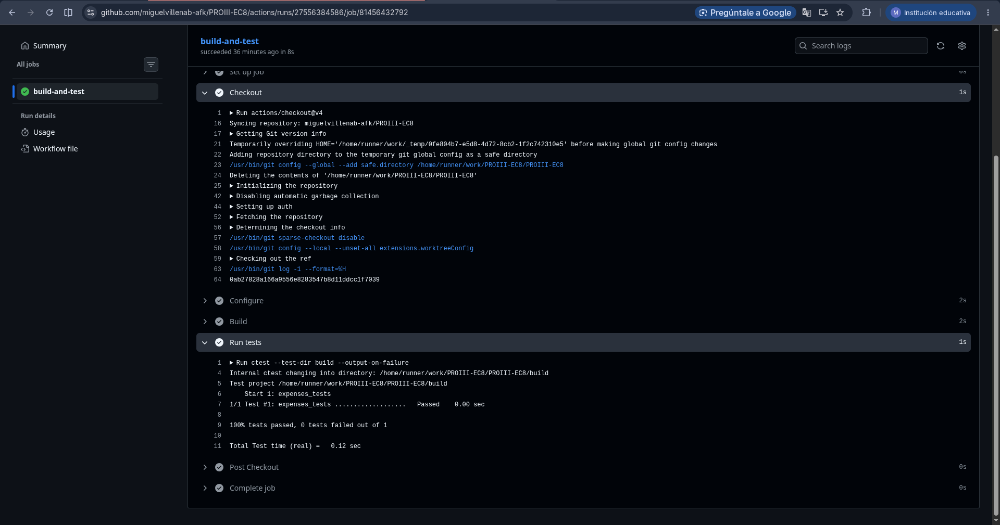

# EC8 : Patrones de Diseño - Gestón de Gastos Personales

# Ejercicio 2: Patrones de Diseño en C++20 – Gestión de Gastos Personales

Este proyecto desarrolla una aplicación de consola para la gestión de gastos personales utilizando C++20. Durante su implementación se aplicaron distintos patrones de diseño con el objetivo de mejorar la extensibilidad, reducir el acoplamiento entre componentes y facilitar el mantenimiento del código.


## Estructura del proyecto
```txt
src/
include/
tests/
CMakeLists.txt
README.md
```
## GitHub Actions

Link : [Link del Workflow](https://github.com/miguelvillenab-afk/PROIII-EC8/actions/runs/27556384586/job/81456432792)
---

##  Patrones aplicados

Uno de los objetivos principales del proyecto fue mantener una arquitectura flexible que permita incorporar nuevas
funcionalidades sin afectar significativamente el código existente. Para ello se emplearon los siguientes patrones de diseño:

### 1. Factory Method (`make_exporter`)
* **Propósito:** Separar la creación de objetos de su utilización.
* **Explicación:** La función plantilla `make_exporter<T>` encapsula la creación de exportadores concretos.
Gracias a esto, el código cliente no necesita conocer los detalles de construcción de clases como `CsvExporter` o `JsonExporter`.
Esta solución evita la proliferación de estructuras condicionales (`if` o `switch`) para seleccionar el tipo de exportador y
facilita la incorporación de nuevos formatos en el futuro, manteniendo el código principal sin cambios importantes.

### 2. Decorator (`AuditedExporter`, `SummaryExporter`)
* **Propósito:** Añadir responsabilidades adicionales a un objeto sin modificar su implementación original.
* **Explicación:** Los decoradores permiten extender el comportamiento de cualquier exportador agregando
funcionalidades complementarias, como el cálculo de resúmenes o el registro de información de auditoría.
De esta forma, los exportadores base permanecen simples y enfocados únicamente en la exportación de datos,
mientras que las características adicionales se incorporan mediante composición. Además, varios decoradores
pueden combinarse entre sí para construir comportamientos más complejos.

### 3. Strategy (`sort_with` y funciones lambda)
* **Propósito:** Permitir seleccionar dinámicamente distintos criterios de ordenamiento.
* **Explicación:** La función `sort_with` recibe una estrategia de comparación como parámetro y delega en 
ella la decisión de cómo ordenar los gastos. Gracias a este enfoque, el algoritmo de ordenamiento queda desacoplado
de los criterios específicos de comparación. Esto permite ordenar por fecha, monto, categoría u otros atributos sin
modificar la implementación de la función principal.

---

## Compilación y Ejecución

El proyecto utiliza CMake y requiere soporte para C++20.

**Configuración**
```bash
cmake -S . -B build -DCMAKE_BUILD_TYPE=Debug
```
**Compilación**
```bash
cmake --build build --config Debug
```
**Ejecución de la aplicación**
```bash
./build/expenses_app
```

**Ejecución de pruebas**
```bash
ctest --test-dir build --output-on-failure
```

---